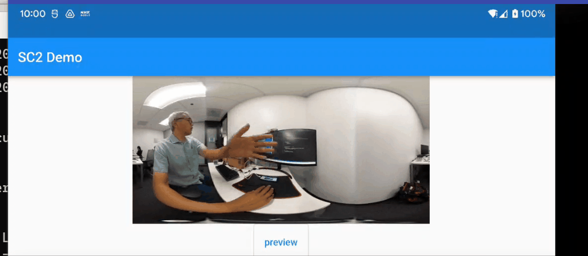

# RICOH THETA SC2 Live Preview Demo

full screen view. Tested August 25, 2022

This only works for SC2.  For Z1 and V, I am using a different
HTTP library.

## TODO

* improve smoothness of video frames to make it closer to official mobile app from RICOH
* implement takePicture and then restart stream
* download image to local device

## Environment

* Flutter 3.0.5
* Dart 2.17.6
